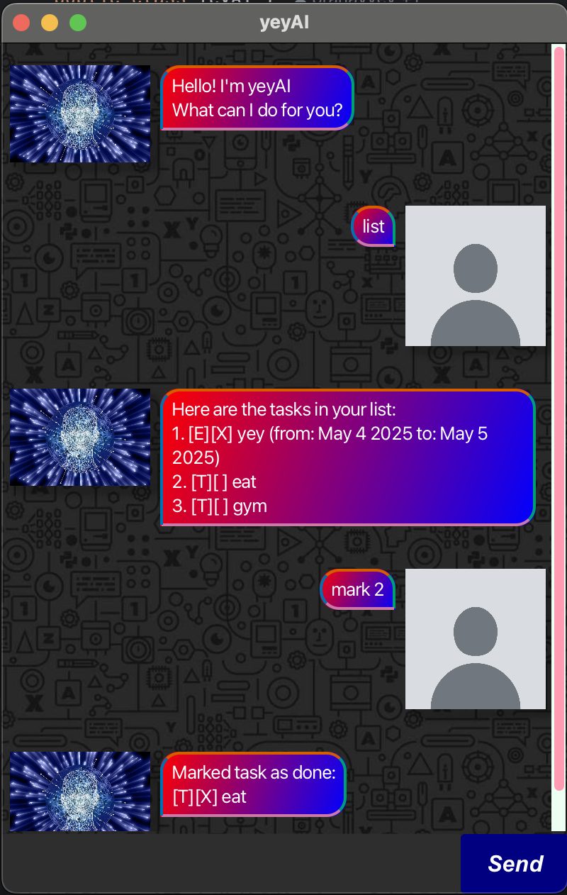

# yeyAI User Guide



// Welcome to yeyAI! A Todo list/Task manager rolled into one

## Adding tasks

There are 3 main types of tasks that you can add into yeyAI

- Todo
- Deadline
- Event

### Todo
Todos are simple tasks with no reference to date or time.
They are usually used to represent miscellaneous and 
trivial tasks.

Example: `todo gym`
```
Added new task:
[T][ ] gym
```
### Deadline
Deadlines are tasks that must be completed by a certain date.
Usually used to represent assignments and deliverables.

Example: `deadline homework /by 2025-03-03`
```
Added new task:
[D][ ] homework (by: Mar 3 2025)
```

### Event
Events are used to represent activities that occur over a period
of time (typically multiple days).

Example: `event bangkok trip /from 2025-03-03 /to 2025-03-06`
```
Added new task:
[E][ ] bangkok trip (from: Mar 3 2025 to: Mar 6 2025)
```
## Features

### List tasks
You can list your tasks to view them all at one go.

Example: `list`
```
Here are the tasks in your list:
1.[T][ ] gym
2.[D][ ] homework (by: Mar 3 2025)
3.[E][ ] bangkok trip (from: Mar 3 2025 to: Mar 6 2025)
```

### Mark and Unmark tasks
You can mark tasks to represent their completion status. Marking a specific task will work based on the index of the 
task in the list above. Similarly, if you ever need to mark the task as incomplete again, you can simply unmark it in 
the same way.

Example: `mark 1`
```
Marked task as done:
[T][X] gym
```
Example: `unmark 1`
```
[T][ ] gym
```

### Find tasks
If your list grows to a very large size, you may want to search for a specific task to see its details, or to
ensure that a similar task does not exist before entering a new one. Find uses the query that you enter and matches
it with the descriptions of existing tasks in the list, and displays them with their original index from the list such
that you can (un)mark edit or delete them.

Example: `find trip`
```
3.[E][ ] bangkok trip (from: Mar 3 2025 to: Mar 6 2025)
```

### Delete tasks
When you do not want to see a task in your list anymore.

Example: `delete 1`
```
Deleted task:
[T][ ] gym
```
Take note that this will change the list indexing, so feel free to use list again to view the indices.

Example: `list`
```
Here are the tasks in your list:
1.[D][ ] homework (by: Mar 3 2025)
2.[E][ ] bangkok trip (from: Mar 3 2025 to: Mar 6 2025)
```

### Edit tasks
You can edit tasks' description or dates if they are deadline or events.

Example: `edit 2 to 2025-03-08`
```
Edited task:
[E][ ] bangkok trip (from: Mar 3 2025 to: Mar 8 2025)
```
